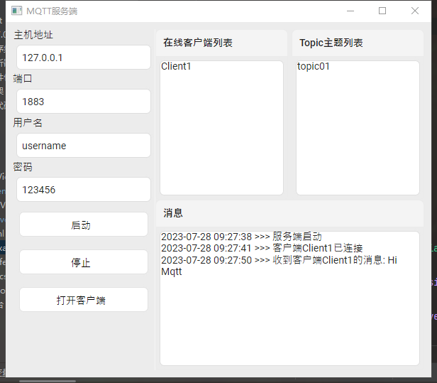
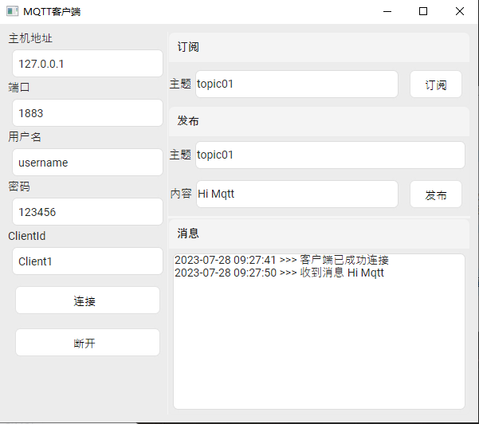

# Ava.MqttTool

## 介绍
Ava.MqttTool是根据Avalonia框架和MQTTnet库写的一个简单的mqtt服务端和客户端通信的客户端程序。

## 鸣谢

[Avalonia](https://github.com/AvaloniaUI/Avalonia)

[MQTTnet](https://github.com/dotnet/MQTTnet.git)

[SukiUI](https://github.com/kikipoulet/SukiUI)

